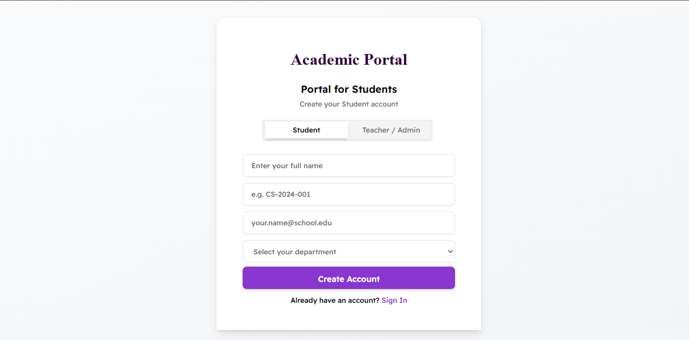
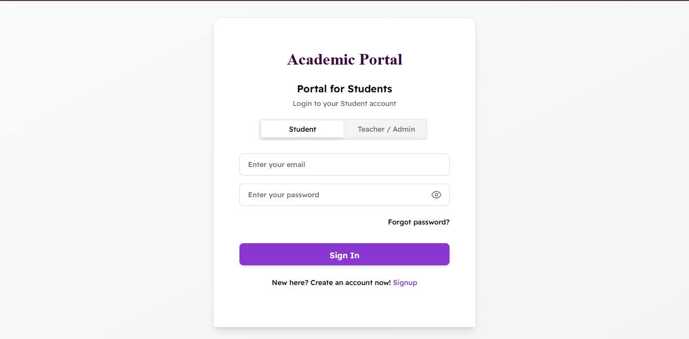
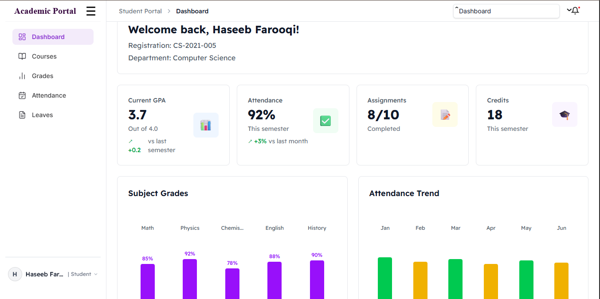
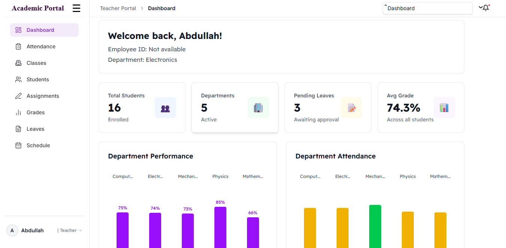
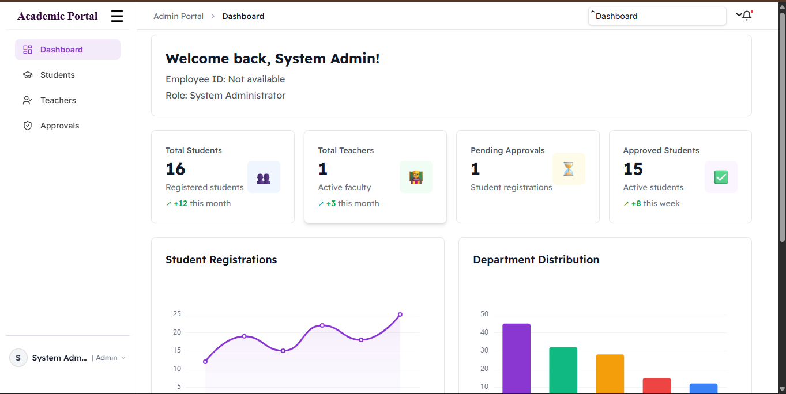
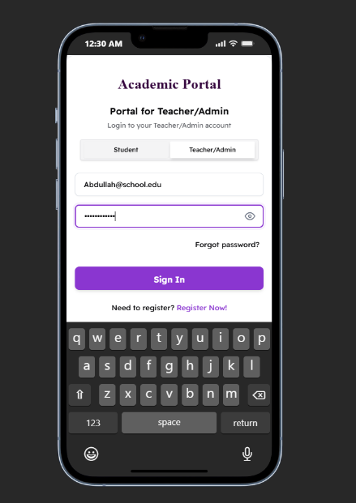

<div align="center">

# 🎓 Academic Portal

### Modern Academic Management Platform

A scalable, role-based academic management system built with **Next.js**, **React**, **Redux Toolkit**, and **Tailwind CSS**.

<p align="center">

<a href="https://academic-1.netlify.app">

</a>

<a href="https://github.com/haseebfarooqi101/academic-portal">

</a>


</p>

<p align="center">

A modern academic management solution featuring dedicated dashboards for Students, Teachers, and Administrators, built with a scalable frontend architecture, reusable components, centralized state management, and responsive design.

</p>

</div>

---

# 📖 Overview

Academic Portal is a full-featured academic management platform designed to simplify the day-to-day workflow of educational institutions.

The application provides **three dedicated user experiences**:

- 👨‍🎓 Student Portal
- 👨‍🏫 Teacher Portal
- 👨‍💼 Administrator Portal

Each role has its own dashboard, permissions, modules, and analytics while sharing a consistent and responsive user interface.

The project demonstrates modern frontend engineering practices including reusable component architecture, centralized state management with Redux Toolkit, responsive layouts, role-based authentication, form validation, and interactive analytics.

---

# ✨ Features

## 🔐 Authentication

- Secure Student Registration
- Teacher Registration
- Role-based Login
- Forgot Password Flow
- Account Approval Workflow
- Email Validation
- Registration Number Validation
- Responsive Authentication Pages

---

## 👨‍🎓 Student Portal

- Dashboard Overview
- GPA Tracking
- Courses
- Grades
- Attendance
- Assignments
- Leave Requests
- Semester Schedule

---

## 👨‍🏫 Teacher Portal

- Dashboard Analytics
- Student Management
- Class Management
- Attendance Tracking
- Assignment Management
- Grade Management
- Leave Management

---

## 👨‍💼 Administrator Portal

- Student Approval System
- Teacher Management
- Student Management
- Department Analytics
- Dashboard Charts
- Registration Monitoring
- System Overview

---

## 📱 Responsive Design

- Desktop Optimized
- Tablet Support
- Mobile Friendly
- Adaptive Sidebar
- Responsive Forms
- Optimized Navigation

---

# 📸 Project Preview

## 📝 Student Registration

<p align="center">

</p>

Students can create an account using their registration number, institutional email address, and department information. New registrations require administrator approval before access is granted.

---

## 🔐 Student Login

<p align="center">

</p>

Secure authentication supporting Students, Teachers, and Administrators with role switching, validation, and password recovery.

---

## 👨‍🎓 Student Dashboard

<p align="center">

</p>

Students can monitor their academic progress, attendance, assignments, credits, grades, and semester performance from a centralized dashboard.

---

## 👨‍🏫 Teacher Dashboard

<p align="center">

</p>

Teachers can manage students, classes, assignments, attendance records, grades, and departmental performance through an intuitive dashboard.

---

## 👨‍💼 Administrator Dashboard

<p align="center">

</p>

Administrators oversee approvals, manage teachers and students, monitor registrations, and analyze institutional statistics through interactive dashboards.

---

## 📱 Mobile Responsive Experience

<p align="center">

</p>

The application is fully responsive, providing a consistent experience across desktops, tablets, and mobile devices.

---
# 🛠️ Tech Stack

<p align="center">


</p>

| Technology | Purpose |
|------------|----------|
| **Next.js 16** | React Framework |
| **React 19** | UI Development |
| **Redux Toolkit** | State Management |
| **Redux Persist** | Persistent Global State |
| **Tailwind CSS v4** | Utility-first Styling |
| **Lucide React** | Icon Library |
| **Apache ECharts** | Analytics & Dashboard Charts |

---

# 🏗️ Architecture

```
                         User
                           │
                           ▼
                  Authentication
                           │
                           ▼
                  Redux Global Store
                           │
          ┌────────────────┴────────────────┐
          │                                 │
          ▼                                 ▼
   Authentication State              UI State
          │                                 │
          └────────────────┬────────────────┘
                           ▼
                   Dashboard Router
                           │
        ┌──────────────────┼──────────────────┐
        ▼                  ▼                  ▼
 Student Dashboard   Teacher Dashboard   Admin Dashboard
        │                  │                  │
        └──────────────┬───┴──────────────────┘
                       ▼
             Reusable React Components
                       ▼
                 Utility Functions
                       ▼
                JSON Data Storage
```

---

# 📂 Project Structure

```
src/
│
├── pages/
│   ├── index.js
│   ├── Login/
│   ├── Signup/
│   ├── TeacherSignup/
│   ├── Dashboard/
│   └── api/
│
├── components/
│   ├── LoginForm/
│   ├── LoginTabs/
│   ├── SignupForm/
│   ├── SignupTabs/
│   ├── TeacherSignupForm/
│   ├── FormField/
│   ├── ForgotPasswordModal/
│   ├── Toast/
│   ├── AccountCreatedSuccess/
│   ├── ApprovalPending/
│   ├── UnifiedDashboard/
│   ├── StudentDashboard/
│   ├── Dashboard/
│   ├── AdminDashboard/
│   ├── DashboardCard/
│   └── AdminChart/
│
├── redux/
│   ├── store/
│   └── slices/
│
├── hooks/
│
├── utils/
│
├── data/
│
└── styles/
```

---

# ⚡ Highlights

✅ Modern Next.js Architecture

✅ React 19

✅ Redux Toolkit State Management

✅ Redux Persist

✅ Fully Responsive Layout

✅ Component-Based Architecture

✅ Form Validation

✅ Role-Based Authentication

✅ Dashboard Analytics

✅ Administrator Approval Workflow

✅ Protected Routes

✅ Reusable Components

---

# 🚀 Getting Started

## Clone Repository

```bash
git clone https://github.com/haseebfarooqi101/academic-portal.git
```

---

## Navigate to Project

```bash
cd academic-portal
```

---

## Install Dependencies

```bash
npm install
```

---

## Start Development Server

```bash
npm run dev
```

Open

```
http://localhost:3000
```

---

## Production Build

```bash
npm run build
```

---

## Start Production Server

```bash
npm start
```

---

# 🔑 Demo Accounts

## 👨‍💼 Administrator

| Email | Password |
|--------|----------|
| admin@school.edu | admin123 |

---

## 👨‍🏫 Teacher

| Email | Password |
|--------|----------|
| teacher@school.edu | teach123 |

---

## 👨‍🎓 Student

Create a student account using a valid

```
@school.edu
```

email address.

The account will remain **Pending Approval** until approved by the Administrator.

---

# 🌐 Live Demo

### Academic Portal

https://academic-1.netlify.app

---

# 🚀 Deployment

The application is deployed on **Netlify** using continuous deployment directly from GitHub.

Every push to the production branch automatically triggers a new deployment.

[](https://academic-1.netlify.app)

---
# 🚀 Future Improvements

Although the current version provides a complete academic management experience, there are several exciting enhancements planned for future releases.

### Planned Features

- 🔐 Firebase Authentication
- ☁️ Cloud Database Integration (Firestore / MongoDB)
- 📂 Assignment File Uploads
- 📩 Email Notifications
- 🔔 Real-time Notifications
- 💬 Student–Teacher Messaging
- 📅 Calendar Integration
- 📈 Advanced Analytics
- 🌙 Dark Mode
- 📱 Progressive Web App (PWA)
- 📲 Native Mobile Application
- 📝 Online Quiz System
- 📚 Course Registration Module
- 🎓 Transcript Generation
- 📊 Attendance Reports Export (PDF / Excel)

---

# 💡 Why This Project?

Academic Portal was developed to demonstrate modern frontend engineering practices while solving a real-world academic management problem.

The project focuses on:

- Building scalable dashboard applications
- Designing reusable React components
- Managing complex application state using Redux Toolkit
- Creating responsive user interfaces
- Implementing role-based authentication
- Developing maintainable project architecture
- Following modern frontend best practices

---

# 📚 What I Learned

Building this project strengthened my understanding of:

- React Component Architecture
- Next.js Application Structure
- Redux Toolkit
- Redux Persist
- Responsive Design
- Form Validation
- State Management
- Authentication Flows
- Dashboard Design
- UI/UX Principles
- Code Organization
- Git & GitHub Workflow

---

# 🎯 Project Goals

The primary objective of this project was to build a scalable academic management system that demonstrates:

- Professional frontend development practices
- Responsive dashboard interfaces
- Reusable UI components
- Centralized application state
- Modern React development
- Clean project architecture

---

# 🤝 Contributing

Contributions, suggestions, and improvements are always welcome.

If you discover a bug or have an idea for a new feature:

1. Fork the repository
2. Create a new branch
3. Commit your changes
4. Open a Pull Request

---

# 📄 License

This project is licensed under the **MIT License**.

Feel free to use the code for educational and personal learning purposes.

---

# 👨‍💻 Author

<div align="center">

## Muhammad Haseeb Farooqi

### Frontend Engineer

Building modern, responsive and accessible web applications using React, Next.js and Tailwind CSS.

📧 **Email**

mhaseebfarooqi2@gmail.com

🌐 **Portfolio**

https://portfolio-m-haseeb-farooqi.vercel.app

💻 **GitHub**

https://github.com/haseebfarooqi101

</div>

---

# ⭐ Support

If you found this project useful or inspiring, consider giving it a ⭐.

It helps others discover the project and motivates continued development.

---

<div align="center">

## Thank you for visiting!

### Happy Coding 🚀


</div>
